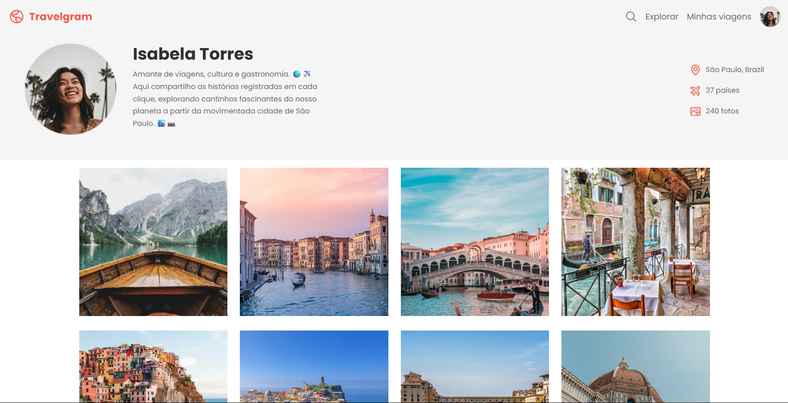

<h1 align="center">🌍 Travelgram — Versão Responsiva</h1>

  <a href="#o-projeto">O Projeto</a>&nbsp;&nbsp;&nbsp;|&nbsp;&nbsp;&nbsp;
  <a href="#tecnologias">Tecnologias</a>&nbsp;&nbsp;&nbsp;|&nbsp;&nbsp;&nbsp;
  <a href="#layout">Layout</a>

  

## 💻 O Projeto 

O Travelgram é uma página de perfil e galeria de fotos para viajantes compartilharem seus registros pelo mundo. Este projeto é uma revisita a uma versão anterior, com foco exclusivo em **responsividade**: adaptar a interface de forma fluida para diferentes tamanhos de tela, do mobile ao desktop, sem quebrar o layout.

Os principais destaques do desenvolvimento incluem:

1. **Arquitetura CSS modular:** Estilização dividida em arquivos separados (`global.css`, `header.css`, `main.css`, `footer.css`, `utility.css`), centralizados via `@import` no `index.css`, facilitando manutenção e escalabilidade.
2. **Responsividade com Media Queries e CSS Nesting:** Uso de `@media (width >= 80em)` com CSS Nesting nativo para definir variações de layout diretamente no escopo do componente, mantendo o código organizado e coeso.
3. **Grid adaptável na galeria:** A galeria de fotos usa `display: grid` que passa de coluna única no mobile para `repeat(4, 17.875rem)` no desktop, reposicionando e redimensionando os itens de forma automática.

## 🚀 Tecnologias 

* **HTML5:** Estrutura semântica da página com `<header>`, `<main>` e `<footer>`, organizando o perfil, a galeria e o rodapé de forma acessível.
* **CSS3:** Responsividade com Media Queries, layout com Flexbox e CSS Grid, variáveis CSS para tokens de design (cores, tipografia) e CSS Nesting nativo para escopar os estilos por componente.
* **Git & GitHub:** Versionamento e deploy da aplicação.
* **Figma**

## 🔖 Layout 

Você pode visualizar e interagir com o projeto através dos links abaixo:

* 📲 **[Acesse o layout original do projeto aqui](https://www.figma.com/community/file/1392188119249243534/perfil-de-viagens)**
* 👉 **[Acesse o site funcionando aqui](https://alissonfa.github.io/travelgram-responsivo)**

**Para rodar no seu computador (Local):**
1. Faça o download ou clone o repositório.
2. Certifique-se de que a estrutura de pastas está correta.
3. Dê um duplo clique no arquivo `index.html` ou abra através da extensão *Live Server* no seu editor de código.

---

Feito com 💜 por **[AlissonFA](https://www.linkedin.com/in/alissonfa/)**